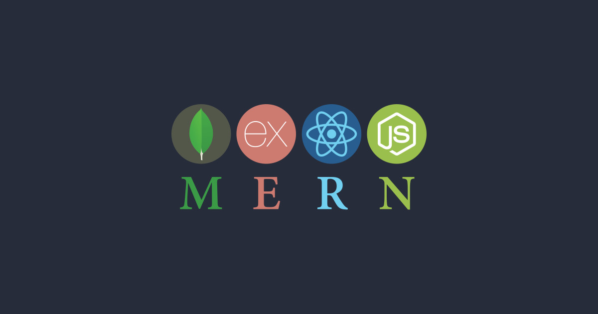
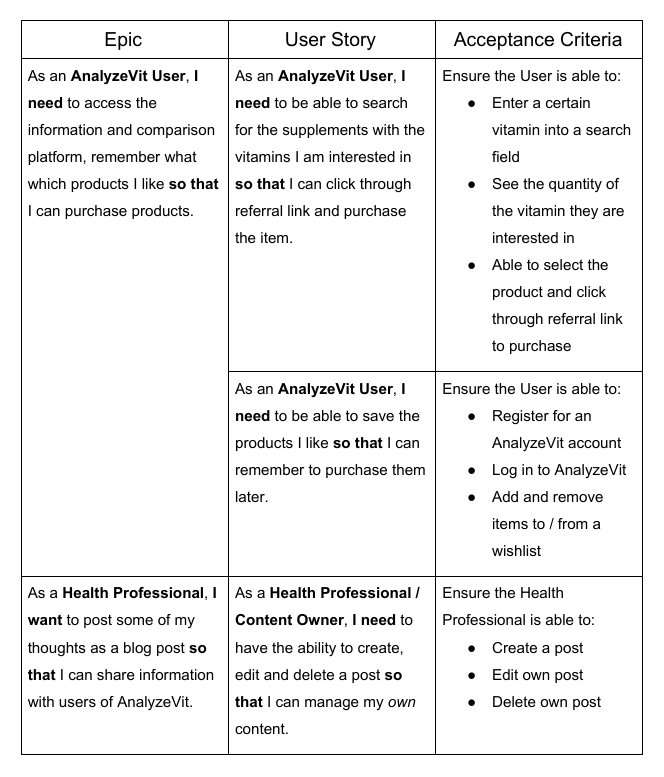
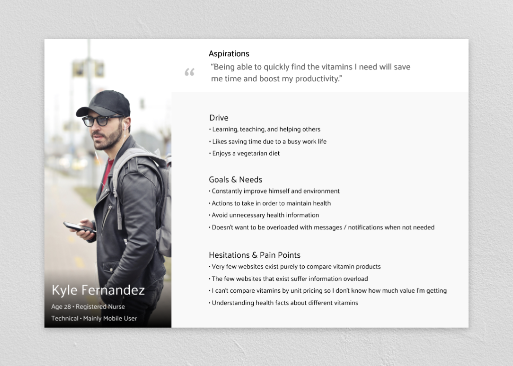
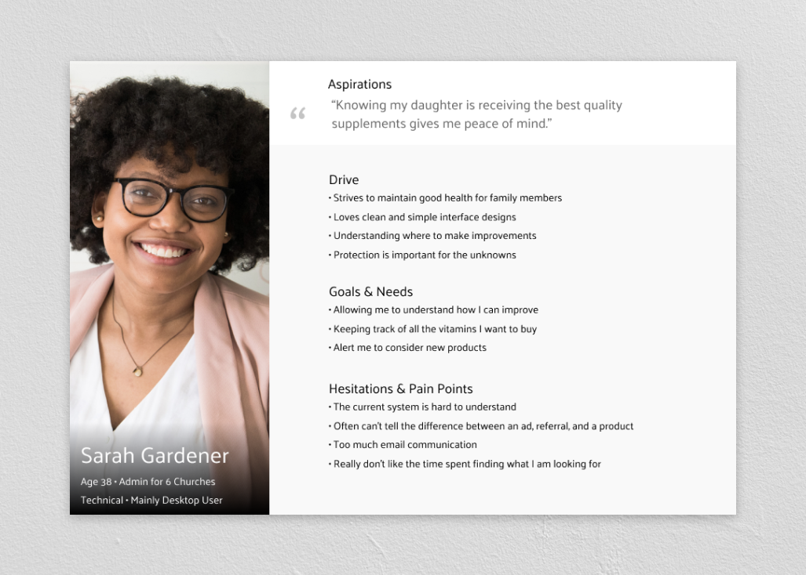
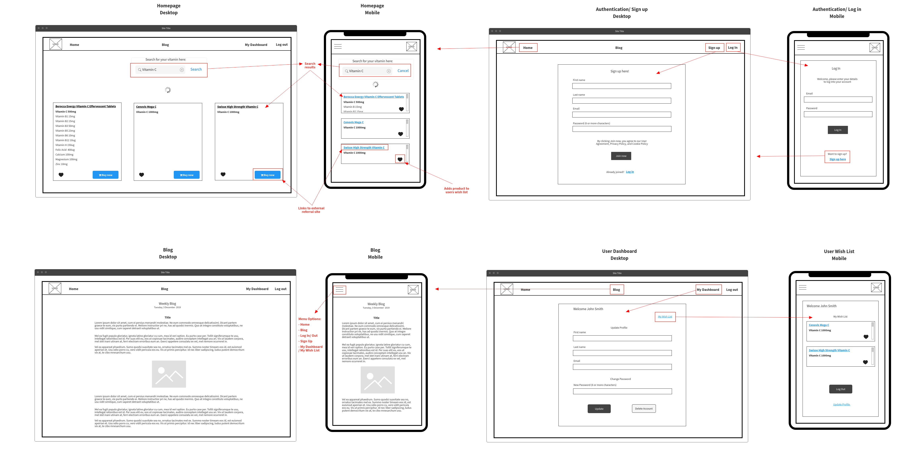
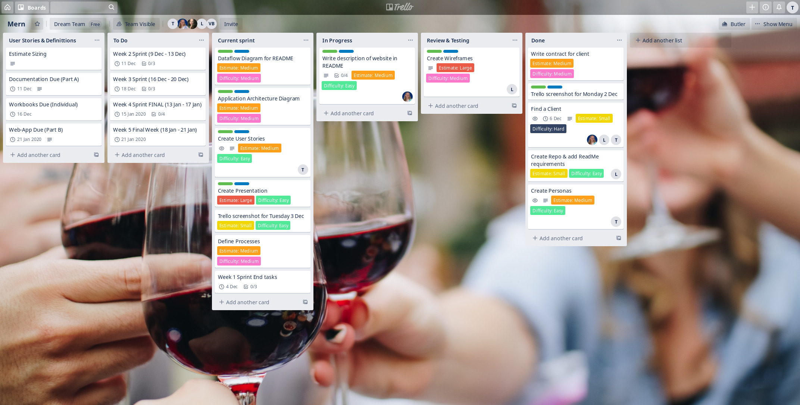
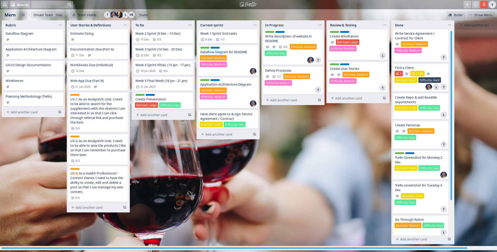

# MERN Assessment

## Authors

* **Carlie Hamilton** – [BlueCodeThree](https://github.com/BlueCodeThree)
* **Lelani Parker** – [Lelani82](https://github.com/Lelani82)
* **Tony Huynh** – [t-hnh10](https://github.com/t-hnh10)

## AnalyzeVit

### Purpose

The purpose of AnalyzeVit is to provide a resource for the general public to compare vitamin content of the many products available on the market. The client identified a void in the market, especially in Australia, which has generally seen a multitude of cumbersome websites lacking simplicity and usability.

It is often an incredibly overwhelming experience when comparing multiple vitamins and supplements simultaneously, especially when the products are multivitamins. The labelling, packaging and provision of health information is generally inconsistent that can further add to the confusion. AnalyzeVit aims to solve this confusion by providing information from a large data set to the public in a consistent and usable format.

### Functionality / Features

AnalyzeVit will consist of several features as outlined below.

#### Search Function

A search function will allow the user to seek information regarding a certain vitamin. The website will query the database and return a list of products that contain said vitamin. The results will be presented in an order that will allow the user to determine which products contain a significant amount of the vitamin or other ingredient they are interested in.

#### Blog

The website will contain a blog function to allow trusted health professionals to provide nutritional information and advice. This is aimed at those who are new to the use of vitamins and supplements. It is an important feature in providing a complete experience for users who wish to learn about vitamins, nutrition and health in general.

#### User Dashboard / Wishlist

Once a user has signed up for an account with AnalyzeVit, they will be able to login to a user dashboard. Here, users will be able to change their details or subscribe to the newsletter should they wish to stay updated with the website's new features or offers that may be provided.

An important feature of having a user account will include being able to maintain a wishlist consisting of vitamin and supplement products. The choice of vitamins on the market is astounding and consumers are often inundated with very similar products. Having researched various products on AnalyzeVit, they can directly add items they are interested in directly to the inbuilt wishlist. This will negate the need to maintain notes elsewhere and centralise all of the user's needs in one place.

### Target Audience

AnalyzeVit recognises a market that encompasses two groups of people who benefit from being informed about vitamins and health supplements.

The first group consists of young, urban professionals who are often too busy to place health as a primary concern. This is where the simplicity and usability of AnalyzeVit will benefit this particular group as they often seek sources of information that are as concise and easy to understand as possible. This group also has a tendency to use their mobile devices often and have considerable technical knowledge in navigating more complex features.

The second group consists of fathers and mothers who, often after giving birth, struggle to balance the responsibilities of caring for their child, and ensuring the health and wellbeing of their family members. This group tends to struggle with overly technical features as they consider them complicated. Thus, they appreciate having simple tools and features.

## Tech Stack

Database: MongoDB

Backend: Node.js & Express.js

Frontend: React

## Dataflow Diagram

## Application Architecture Diagram

## User Stories

### User Personas

To assist with the writing of User Stories, User Personas were created in order to allow the team to learn about and focus on the spectrum of goals and needs of our users. 

## Wireframes

## Trello Board Screenshots

Monday 2 Dec 2019

Tuesday 3 Dec 2019

Wednesday 4 Dec 2019

## Planning Methodology